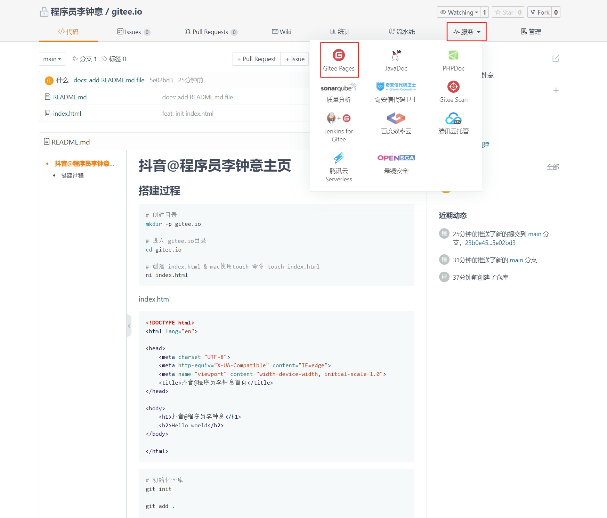
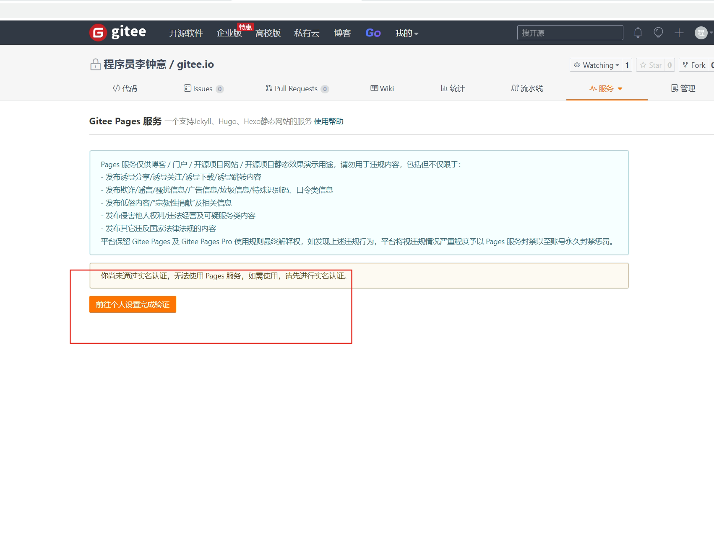
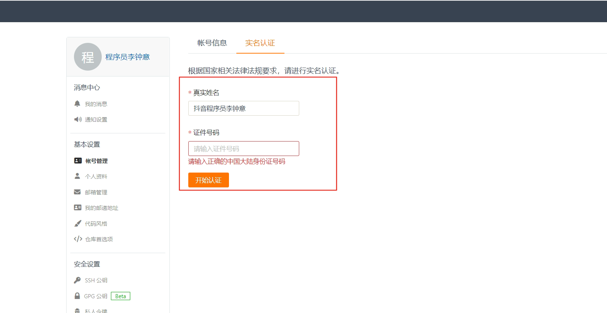
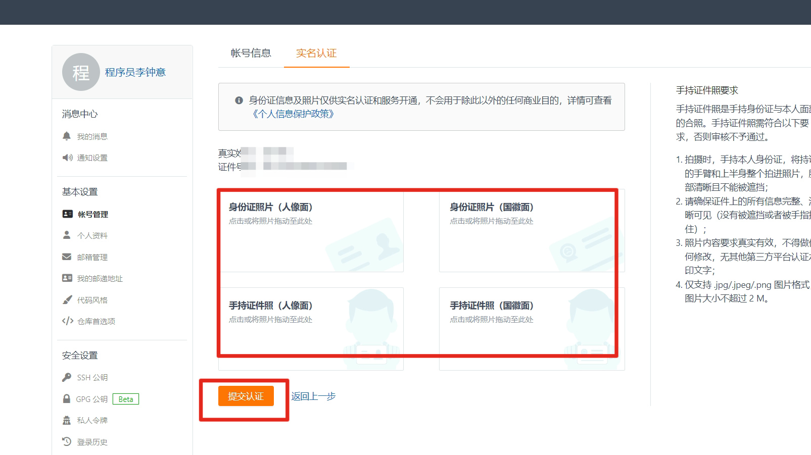
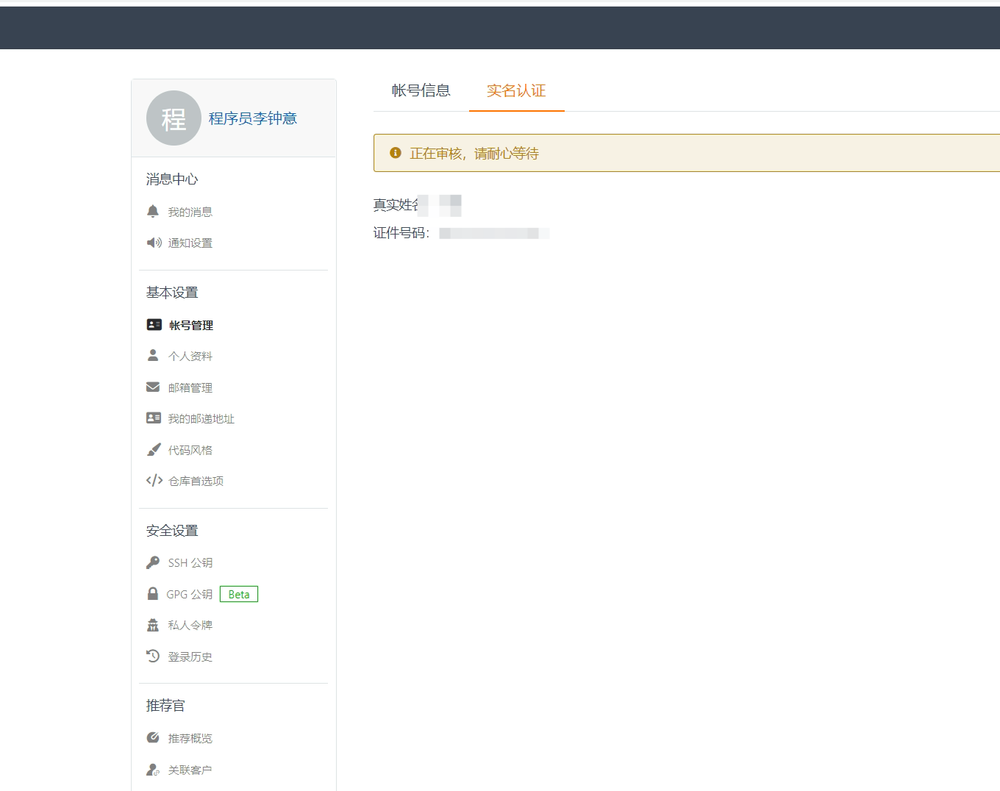

# 抖音@程序员李钟意主页

静态页面官网

## 搭建过程

### Github page

#### 创建仓库

仓库名称为 `[github 名称].github.io`

例如我的名称 xieerduos

那么我创建的名称 `xieerduos.github.io`

#### 提交代码

包含 index.html 的代码

### Gitee (国内)

#### 创建仓库并提交到远程

```bash
# 创建目录
mkdir -p gitee.io

# 进入 gitee.io目录
cd gitee.io

# 创建 index.html & mac使用touch 命令 touch index.html
ni index.html
```

index.html

```html
<!DOCTYPE html>
<html lang="en">
  <head>
    <meta charset="UTF-8" />
    <meta http-equiv="X-UA-Compatible" content="IE=edge" />
    <meta name="viewport" content="width=device-width, initial-scale=1.0" />
    <title>抖音@程序员李钟意首页</title>
  </head>

  <body>
    <h1>抖音@程序员李钟意</h1>
    <h2>Hello world</h2>
  </body>
</html>
```

```bash
# 初始化仓库
git init

git add .

git commit -m "Initial commit && add index.html file"

# 重命名本地分支
git branch -m master main

# 打开gitee.com 登录，后创建 gitee.io仓库
# 拷贝已有仓库代码

git remote add origin git@gitee.com:fe521/gitee.io.git

git push -u origin main

# 把本地仓库提交到远程
git push origin main
```

#### Gitee Pages （实名认证）

参考地址：

https://gitee.com/help/articles/4136

---

1. 首页 - 服务 - Gitee Pages

<br/>

2. 点击个人设置完成验证

<br/>

3. 开始认证

<br/>

4. 输入表单信息

<br/>

5. 提交认证

<br/>

6. 等待审核通过
