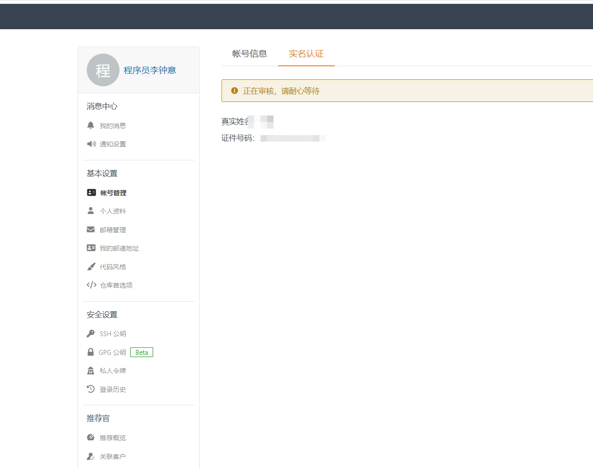
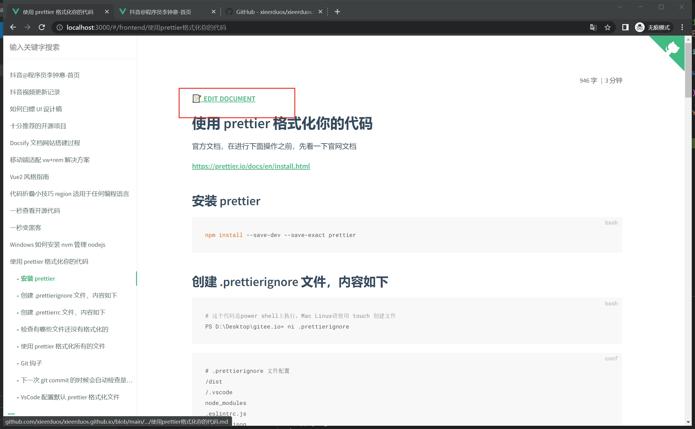
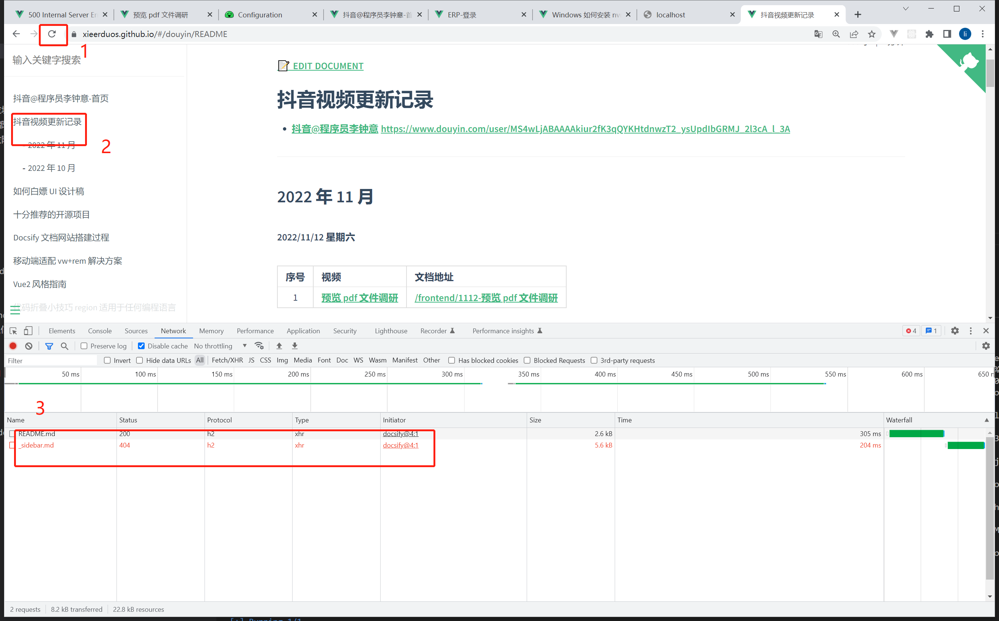

# Docsify 文档网站搭建过程

静态页面官网

## 抖音@程序员李钟意

主页搭建

## 域名网站-搭建过程

### Github page

Github page 官方快速入门 https://docs.github.com/cn/pages/quickstart

#### 创建仓库

仓库名称为 `[github 名称].github.io`

例如我的名称 xieerduos

那么我创建的名称 `xieerduos.github.io`

#### 提交代码

包含 index.html 的代码

### Gitee (国内)

#### 创建仓库并提交到远程

```bash
# 创建目录
mkdir -p gitee.io

# 进入 gitee.io目录
cd gitee.io

# 创建 index.html & mac使用touch 命令 touch index.html
ni index.html
```

index.html

```html
<!DOCTYPE html>
<html lang="en">
  <head>
    <meta charset="UTF-8" />
    <meta http-equiv="X-UA-Compatible" content="IE=edge" />
    <meta name="viewport" content="width=device-width, initial-scale=1.0" />
    <title>抖音@程序员李钟意首页</title>
  </head>

  <body>
    <h1>抖音@程序员李钟意</h1>
    <h2>Hello world</h2>
  </body>
</html>
```

```bash
# 初始化仓库
git init

git add .

git commit -m "Initial commit && add index.html file"

# 重命名本地分支
git branch -m master main

# 打开gitee.com 登录，后创建 gitee.io仓库
# 拷贝已有仓库代码

git remote add origin git@gitee.com:fe521/gitee.io.git

git push -u origin main

# 把本地仓库提交到远程
git push origin main
```

#### Gitee Pages （实名认证）

参考地址：

https://gitee.com/help/articles/4136

---

1. 首页 - 服务 - Gitee Pages

<br/>

2. 点击个人设置完成验证

<br/>

3. 开始认证

<br/>

4. 输入表单信息

<br/>

5. 提交认证

<br/>

6. 等待审核通过

## docsify 项目搭建

### 初始化 docsify 项目

https://docsify.js.org/#/zh-cn/quickstart

```bash
npm i docsify-cli -g

docsify init ./docs

docsify serve docs
```

### 优化项目结构

移动`docs/`下的文件到项目根目录

```bash
# 修改运行命令
docsify serve .

```

### 添加常用插件

全文检索

| 序号 | 插件名称 | URL                                                                                   |
| :--: | :------- | :------------------------------------------------------------------------------------ |
|  1   | 全文检索 | https://docsify.js.org/#/zh-cn/plugins?id=%e5%85%a8%e6%96%87%e6%90%9c%e7%b4%a2-search |

```html
<script src="//cdn.jsdelivr.net/npm/docsify/lib/plugins/search.min.js"></script>
```

```js
window.$docsify = {
  // #region 全文检索
  search: {
    maxAge: 86400000, // 过期时间，单位毫秒，默认一天
    paths: 'auto', // or 'auto'
    placeholder: '输入关键字搜索',
    placeholder: {
      '/en/': 'Type to search',
      '/': '输入关键字搜索'
    },
    noData: {
      '/en/': 'No Results',
      '/': '找不到结果'
    },
    // 搜索标题的最大层级, 1 - 6
    depth: 6,
    hideOtherSidebarContent: true, // 是否隐藏其他侧边栏内容
    // 避免搜索索引冲突
    // 同一域下的多个网站之间
    namespace: 'website-1',
    // 使用不同的索引作为路径前缀（namespaces）
    // 注意：仅适用于 paths: 'auto' 模式
    // 初始化索引时，我们从侧边栏查找第一个路径
    // 如果它与列表中的前缀匹配，我们将切换到相应的索引
    pathNamespaces: ['/en'],

    // 您可以提供一个正则表达式来匹配前缀。在这种情况下，
    // 匹配到的字符串将被用来识别索引
    pathNamespaces: /^(\/(en))?(\/(v1|v2))?/
  }
  // #endregion
};
```

其他插件

| 序号 | 插件名称              | URL                                                                                              |
| :--: | :-------------------- | :----------------------------------------------------------------------------------------------- |
|  1   | 图片缩放 - Zoom image | https://docsify.js.org/#/zh-cn/plugins?id=%e5%9b%be%e7%89%87%e7%bc%a9%e6%94%be-zoom-image        |
|  2   | 复制到剪贴板          | https://docsify.js.org/#/zh-cn/plugins?id=%e5%a4%8d%e5%88%b6%e5%88%b0%e5%89%aa%e8%b4%b4%e6%9d%bf |
|  3   | 代码高亮              | https://docsify.js.org/#/zh-cn/language-highlight                                                |
|  4   | 字数统计              | https://docsify.js.org/#/zh-cn/plugins?id=%e5%ad%97%e6%95%b0%e7%bb%9f%e8%ae%a1                   |

### 定制侧边栏

```js
window.$docsify = {
  loadSidebar: true // 定制侧边栏 _sidebar.md生效
};
```

```md
<!-- 左侧菜单栏 -->

- [抖音@程序员李钟意-首页](/)

- [抖音视频更新记录](/douyin/README.md)

- [Docsify 文档网站搭建过程](/docsify/README.md)

- [移动端适配 vw+rem 解决方案](/frontend/移动端适配vw+rem解决方案.md)
```

### 显示最大目录级

```js
window.$docsify = {
  // h1 ~ h6
  subMaxLevel: 4 // 默认显示 `####` (h4)以内的标题
};
```

### 谷歌统计 - Google Analytics

https://docsify.js.org/#/zh-cn/plugins?id=%e8%b0%b7%e6%ad%8c%e7%bb%9f%e8%ae%a1-google-analytics

https://analytics.google.com/

登录根据指示操作

数据流 - 创建 - 网站名称、域名等信息填写

再次登录时 - 左下角 - 管理 -数据流

```html
<!-- Google tag (gtag.js) -->
<script async src="https://www.googletagmanager.com/gtag/js?id=G-C1YQQ3EKMQ"></script>
<script>
  window.dataLayer = window.dataLayer || [];
  function gtag() {
    dataLayer.push(arguments);
  }
  gtag('js', new Date());

  gtag('config', 'G-C1YQQ3EKMQ');
</script>
```

### 增加编辑文档按钮

新增代码

```html
<link rel="stylesheet" href="//cdn.jsdelivr.net/npm/docsify@4/lib/themes/vue.css" />
<!-- docsify-edit-on-github -->
<!-- <script src="//cdn.jsdelivr.net/npm/docsify-edit-on-github"></script> -->
<script>
  window.$docsify = {
    // ...
    plugins: [
      // EditOnGithubPlugin.create('https://github.com/xieerduos/xieerduos.github.io/blob/main/', null, '编辑'),
      function (hook, vm) {
        hook.beforeEach(function (html) {
          var url = 'https://github.com/xieerduos/xieerduos.github.io/blob/main/' + vm.route.file;
          var editHtml = '[📝 EDIT DOCUMENT](' + url + ')\n';

          return editHtml + html + '\n----\n' + 'Last modified {docsify-updated} ' + editHtml;
        });
      }
    ]
  };
</script>
```

效果图

<br/>

### 解决目录下不存在 \_sidebar.md 时出现 404 bug

<br/>

```js
window.$docsify = {
  loadSidebar: true, // 定制侧边栏 _sidebar.md生效
  alias: {
    '/.*/_sidebar.md': '/_sidebar.md' // 嵌套的侧边栏
  }
};
```

### 增加时序图的支持

https://github.com/mermaid-js/mermaid/blob/develop/README.zh-CN.md

### 优化网页加载速度

把国外 cdn 改为网站本地静态资源
