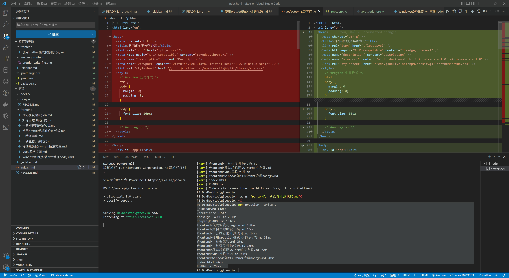
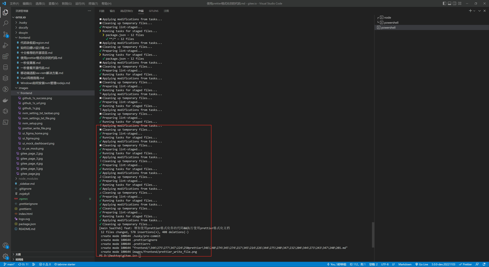
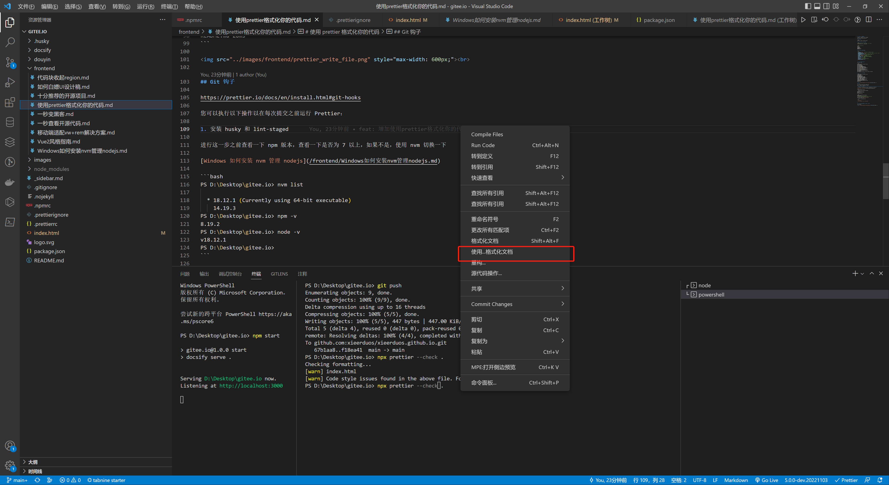
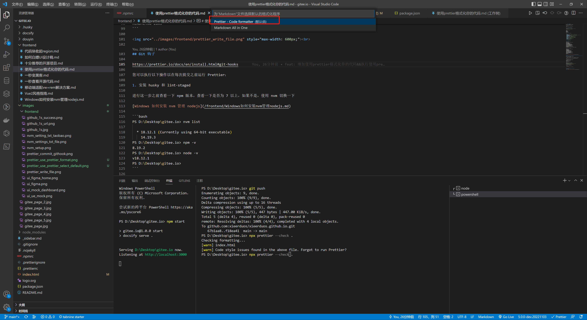

# 使用 prettier 格式化你的代码

官方文档，在进行下面操作之前，先看一下官网文档

https://prettier.io/

https://prettier.io/docs/en/install.html

## 安装 prettier

```bash
npm install --save-dev --save-exact prettier
```

## 创建 .prettierignore 文件，内容如下

```bash
# 这个代码是power shell上执行，Mac Linux请使用 touch 创建文件
PS D:\Desktop\gitee.io> ni .prettierignore
```

```conf
# .prettierignore 文件配置
/dist
/.vscode
node_modules
.eslintrc.js
package.json
package-lock.json
components.d.ts
```

## 创建 .prettierrc 文件，内容如下

来源于这里自己配置的 https://prettier.io/playground/

```JSON
{
  "arrowParens": "always", // 箭头函数，只有一个参数的时候，也需要括号
  "bracketSameLine": true,
  "bracketSpacing": false, // 对象是否有空格,值true `{ name: 'zhongyi' }` false {name: 'zhongyi'}
  "embeddedLanguageFormatting": "auto",
  "htmlWhitespaceSensitivity": "css", // 根据显示样式决定 html 要不要折行
  "jsxSingleQuote": false, // jsx属性值是否为单引号，不为单引号
  "printWidth": 120, // 超出120个字符就换行
  "proseWrap": "preserve", // 使用默认的折行标准
  "quoteProps": "as-needed", // 对象的 key 仅在必要时用引号
  "insertPragma": false, // 不需要自动在文件开头插入 @prettier
  "requirePragma": false, // 不需要自动在文件开头插入 @prettier
  "semi": true, // 末尾增加分号";"
  "singleQuote": true,// 使用单引号
  "tabWidth": 2, // 缩进字符（两个）
  "trailingComma": "none",// 对象后面 不需要逗号","
  "useTabs": false, // 不使用tab缩进
  "vueIndentScriptAndStyle": false
}

```

## 检查有哪些文件还没有格式化的

npx prettier --check .

```bash
PS D:\Desktop\gitee.io> npx prettier --check .
Checking formatting...
[warn] _sidebar.md
[warn] docsify\README.md
[warn] douyin\README.md
[warn] frontend\代码块收起region.md
[warn] frontend\如何白嫖UI设计稿.md
[warn] frontend\十分推荐的开源项目.md
[warn] frontend\1106-使用prettier格式化你的代码.md
[warn] frontend\一秒变黑客.md
[warn] frontend\一秒查看开源代码.md
[warn] frontend\移动端适配vw+rem解决方案.md
[warn] frontend\Vue2风格指南.md
[warn] frontend\Windows如何安装nvm管理nodejs.md
[warn] index.html
[warn] README.md
[warn] Code style issues found in 14 files. Forgot to run Prettier?
```

## 使用 prettier 格式化所有的文件

```bash
PS D:\Desktop\gitee.io> npx prettier --write .
_sidebar.md 130ms
.prettierrc 215ms
docsify\README.md 251ms
douyin\README.md 111ms
frontend\代码块收起region.md 188ms
frontend\如何白嫖UI设计稿.md 15ms
frontend\十分推荐的开源项目.md 14ms
frontend\1106-使用prettier格式化你的代码.md 33ms
frontend\一秒变黑客.md 95ms
frontend\一秒查看开源代码.md 16ms
frontend\移动端适配vw+rem解决方案.md 89ms
frontend\Vue2风格指南.md 98ms
frontend\Windows如何安装nvm管理nodejs.md 20ms
index.html 74ms
README.md 28ms
```

<br>

## Git 钩子

https://prettier.io/docs/en/install.html#git-hooks

您可以执行以下操作以在每次提交之前运行 Prettier：

1. 安装 husky 和 ​​lint-staged

进行这一步之前查看一下 npm 版本，查看一下是否为 7 以上，如果不是，使用 nvm 切换一下

[Windows 如何安装 nvm 管理 nodejs](/frontend/Windows如何安装nvm管理nodejs.md)

```bash
PS D:\Desktop\gitee.io> nvm list

  * 18.12.1 (Currently using 64-bit executable)
    14.19.3
PS D:\Desktop\gitee.io> npm -v
8.19.2
PS D:\Desktop\gitee.io> node -v
v18.12.1
PS D:\Desktop\gitee.io>
```

```bash
npm install --save-dev husky lint-staged
npx husky install
# 注意： npm set-script命令至少需要npm v7.x。
# 请参阅https://docs.npmjs.com/cli/v7/commands/npm-set-script。
npm set-script prepare "husky install"
npx husky add .husky/pre-commit "npx lint-staged"
```

2. 将以下内容添加到您的 package.json:

```bash
{
  "lint-staged": {
    "**/*": "prettier --write --ignore-unknown"
  }
}
```

## 下一次 git commit 的时候会自动检查是否通过 prettier

commit 时效果如下

<br>

## VsCode 配置默认 prettier 格式化文件

1. 要格式化的文件 鼠标右键 - 使用...格式化文档

<br>

2. 配置默认格式化程序

<br>

3. 选择 Prettier code formatter

<br>

## 校验 commit 信息

使用 husky 进行提交前的代码规范校验和 commit 信息检查 https://blog.csdn.net/huangpb123/article/details/102690412
