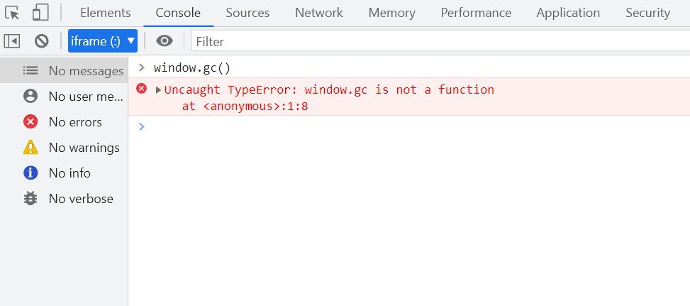
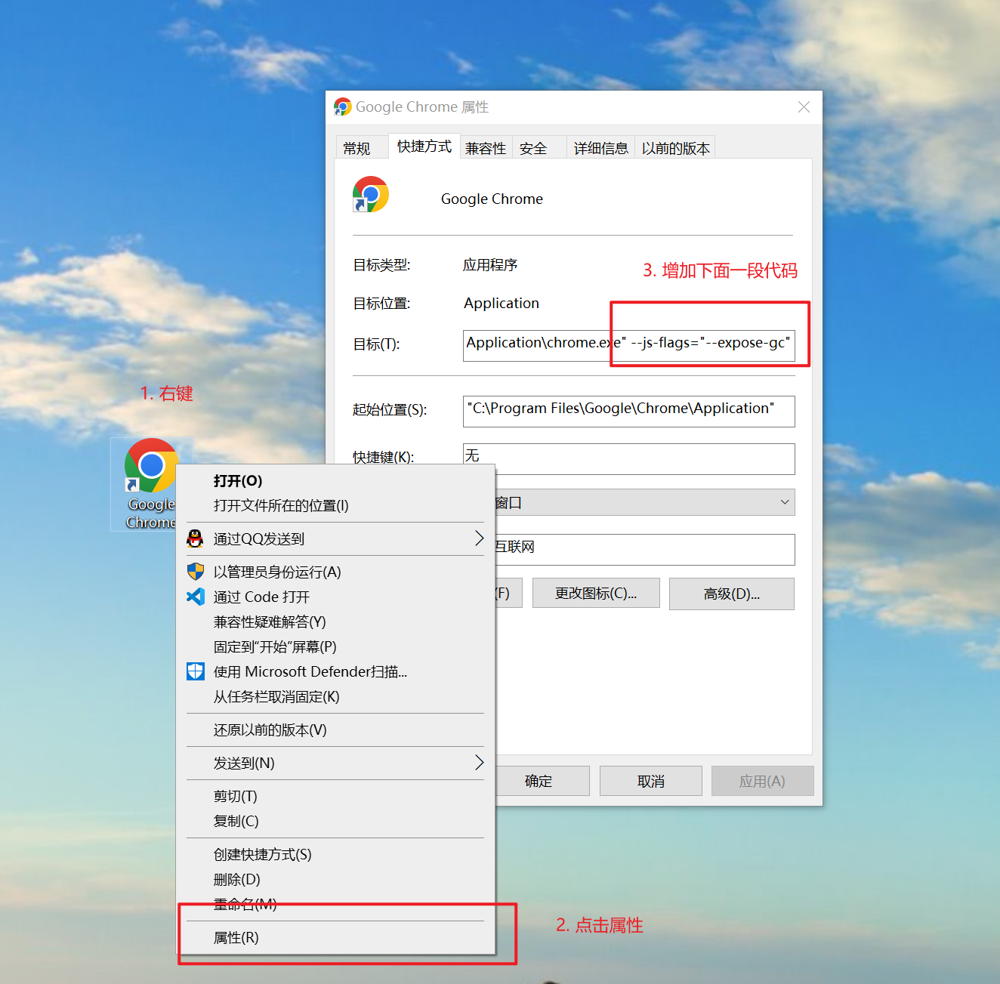
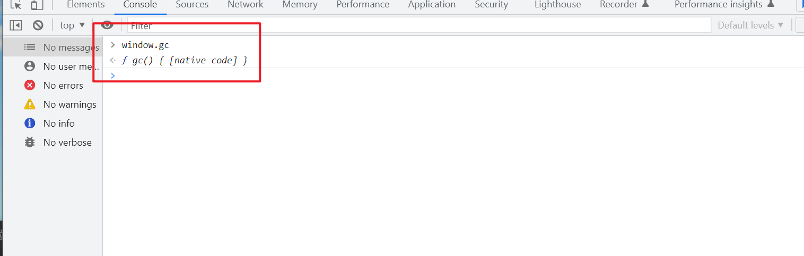

# 如何让浏览器马上进行垃圾回收

## 怎么做？

在代码里面增加 `window.gc()` 就可以让垃圾回收马上执行

```js
window.gc();
```

嗯哼？

<br>

需要在启动 chrome 的时候增加参数才可以

## 启动 chrome 增加参数

在执行 exe 文件后面增加 `--js-flags="--expose-gc"`参数，方法如下：

浏览器桌面图标 - 鼠标右键 - 属性 - 目标（输入框内） - 添加这个后缀 ` --js-flags="--expose-gc"`

如何下图

<br>

## 添加参数后

1. 关闭所有浏览器窗口，双击浏览器图标<br/>
2. 控制台输入 window.gc 查看 输出的是一个 function<br/>

<br>

## 为什么要打开 gc？

通过手动强制进行垃圾回收，来调试分析内存泄漏问题，找到内存增长的原因

如果你的应用足够大和复杂，并存在不知名的原因导致内存增长，那么它将会对你很有帮助

如果你使用 electron 开发桌面端应用，分析内存增长，那么它也会对你有帮助
