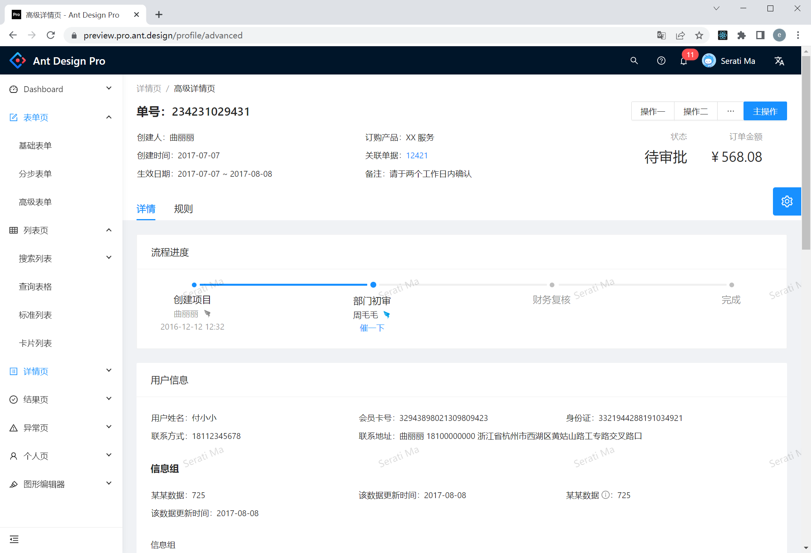
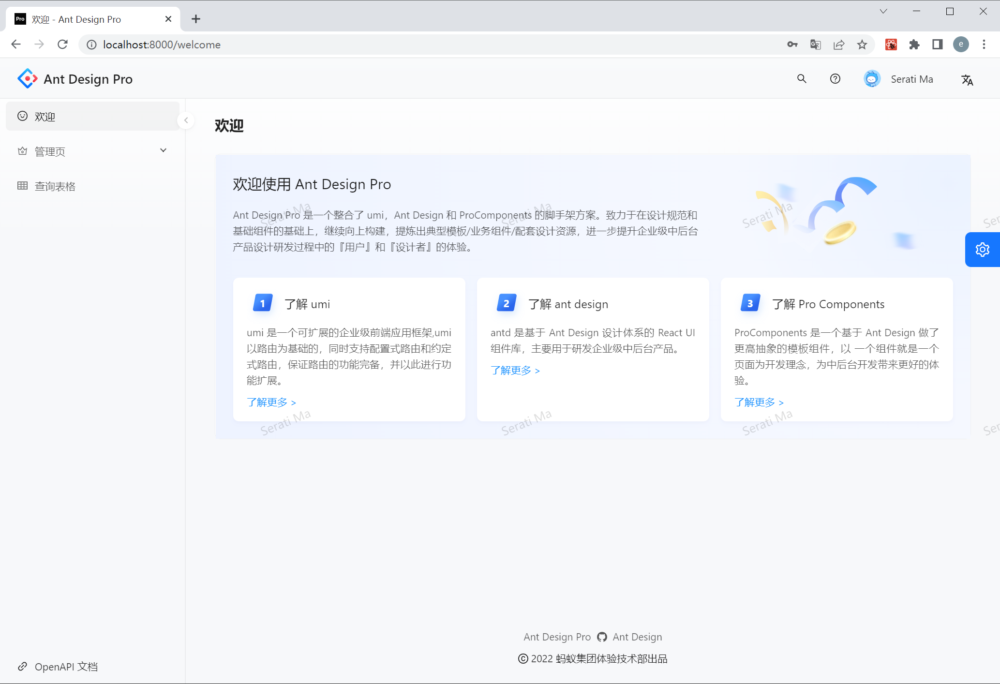
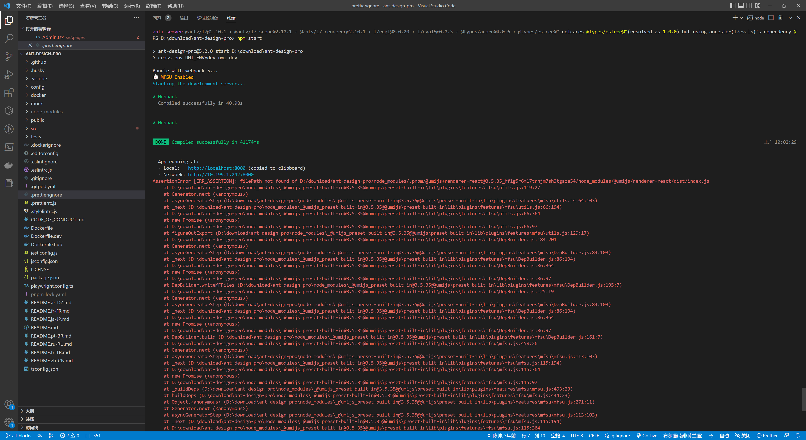
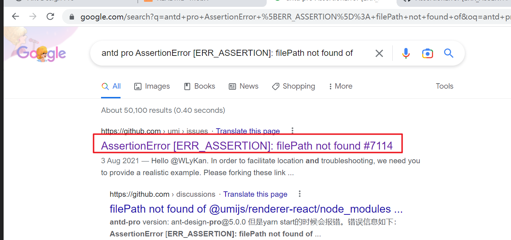
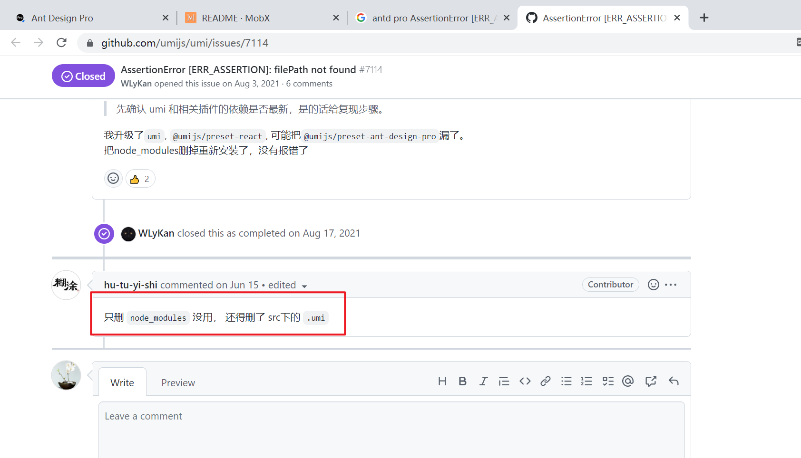

# 国内常用的 React 技术栈有哪些

## React Hook （推荐）

react hook reate-react-app antd g2/echart （typescript）

[何时使用 Context - React 官方文档](https://zh-hans.reactjs.org/docs/context.html#when-to-use-context)

Context 设计目的是为了共享那些对于一个组件树而言是“全局”的数据，例如当前认证的用户、主题或首选语言。举个例子，在下面的代码中，我们通过一个 “theme” 属性手动调整一个按钮组件的样式：

作者建议：小项目无需引入 redux 或者 mobx，直接使用 use context 即可

## Redux

react redux create-react-app/vite antd g2/echart（typescript）

https://redux.js.org/

就像一副眼镜，当你需要的时候你就用它 [引用 vuex 作者的话](https://vuex.vuejs.org/zh/index.html#%E4%BB%80%E4%B9%88%E6%83%85%E5%86%B5%E4%B8%8B%E6%88%91%E5%BA%94%E8%AF%A5%E4%BD%BF%E7%94%A8-vuex%EF%BC%9F)

## MobX

react mobx reate-react-app/vite antd g2/echart （typescript）

https://mobx.js.org/README.html

Mobx 使得 React 代码写起来更像 vuex

作者有幸使用它做过几个项目，特别不推荐使用 Mobx，特别是 React 小白

你不太熟悉 Mobx 的时候，会遇到很多莫名其妙的问题

## Nextjs （推荐）

https://nextjs.org/

react nextjs create-react-app antd g2/echart （typescript）

## umi + dva

umi，中文可发音为乌米，是一个可插拔的企业级 react 应用框架。

[他和 dva、roadhog 是什么关系？](https://v2.umijs.org/zh/guide/#%E4%BB%96%E5%92%8C-dva%E3%80%81roadhog-%E6%98%AF%E4%BB%80%E4%B9%88%E5%85%B3%E7%B3%BB%EF%BC%9F)

roadhog 是基于 webpack 的封装工具，目的是简化 webpack 的配置
umi 可以简单地理解为 roadhog + 路由，思路类似 next.js/nuxt.js，辅以一套插件机制，目的是通过框架的方式简化 React 开发
dva 目前是纯粹的数据流，和 umi 以及 roadhog 之间并没有相互的依赖关系，可以分开使用也可以一起使用，个人觉得 umi + dva 是比较搭的

## 中后台解决方案 Ant Design Pro

Github https://github.com/ant-design/ant-design-pro

线上预览 https://preview.pro.ant.design/

<br>

[Ant Design Pro](https://pro.ant.design/zh-CN/docs/getting-started) 是基于 Ant Design 和 umi 的封装的一整套企业级中后台前端/设计解决方案。

[启动项目 使用 `npm start` Github 首页没有提示 吐槽... 这个也许就是 star 少的原因](https://pro.ant.design/zh-CN/docs/development/#%E5%90%AF%E5%8A%A8%E9%A1%B9%E7%9B%AE)

```bash
# 克隆项目
git clone git@github.com:ant-design/ant-design-pro.git

# 切换目录
cd ant-design-pro

# 安装模块
# OR pnpm instsall
npm install

# 启动项目
npm start
```

和你想象的不一样

<br>

详细查看了一下，需要切换分支，执行下面命令即可

```bash
# 把远程分支拉取到本地 映射到all-blocks 分支
# git fetch origin [远程分支]:[本地分支]
git fetch origin all-blocks:all-blocks

# 切换分支
git checkout all-blocks

# OR pnpm i
npm i

# 启动项目
npm start
```

一堆错误，emmmmmmm ...

<br>

删掉 node_modules 重新下载

```bash
# git bash上执行
rm -rf node_modules

# 启动项目
npm install

# 启动项目
npm start
```

还是报错，如下：

<br>

搜索引擎 - `antd pro AssertionError [ERR_ASSERTION]: filePath not found of`

<br>

解决方案 https://github.com/umijs/umi/issues/7114

往下看，别人也遇到了

<br>

.umi 在 src 下面 找了半天 emmm...

```bash
# git bash上执行
rm -rf node_modules src/.umi
```

因为我第一次使用了 pnpm

所以 要把 pnpm-lock.yaml 删掉

```bash
# git bash上执行
rm -rf pnpm-lock.yaml
```

把缓存删掉

```bash
PS D:\.pnpm-store> pnpm store path
D:\.pnpm-store\v3
PS D:\.pnpm-store>
```

```bash
# git bash上执行
rm -rf D:\.pnpm-store\v3
```

```bash
# 启动项目
npm install

# 启动项目
npm start
```
