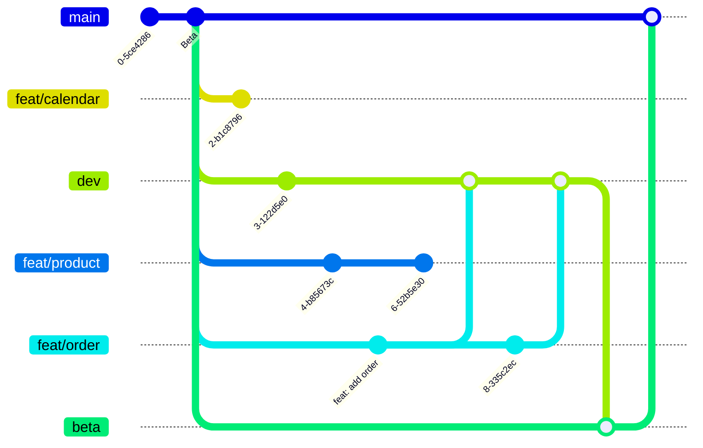

# git merge 工作流

多人协同，超实用

##　介绍

小白 git 分支操作

此视频面向对 git 不熟悉的同学

## 分支管理

分支列表

| 序号 | 分支名称      | 摘要             | 备注                            |
| :--: | :------------ | :--------------- | :------------------------------ |
|  1   | main          | 线上分支         | 保护分支 +2 审核                |
|  2   | beta          | 预上线测试环境   | 保护分支 测试环境和线上内容一致 |
|  2   | dev           | 测试环境         | 测试环境 全部功能               |
|  3   | feat/product  | 产品模块开发分支 | 研发张三                        |
|  4   | feat/order    | 订单模块开发分支 | 研发李四                        |
|  5   | feat/meeting  | 会控模块开发分支 | 研发李钟意                      |
|  6   | feat/calendar | 日历模块开发分支 | 研发王五                        |

## 图示

## 团队约定：

1. 所有开发分支名称 必须以 `feat/` 开头，基于 `main` 分支检出;

2. 开发分支开发阶段只允许往 `dev` 合入，不得从 dev 往`feat/`开头分支合入代码;

3. 合入`dev`分支之前先 从`merge main`分支到当前分支（`main` -> `feat/`）;

## 开发分支开发完毕

`feat/order` --> `dev` 合并 `feat/order` --> 提交测试 --> 测试 发现 bug
--> `feat/order` 修改 bug --> `dev` 合并 `feat/order`

bug 修改完成，测试回归完成（也有人叫做冒烟）

## 代码合并-预上线

在 `beta` 分支 `git merge feat/order` 分支

线上测试，有 bug 赶紧回滚

看情况 - to C 产品可能会在这个环境测试两个星期

也有就是简单过一下，没啥问题直接上线

## 生产环境-线上

1. 提交上线工单 - 测试报告（小公司可能没有这个）

2. 项目领导审核 - 测试领导审核 - 团队领导审核（更高负责人审核）

3. 工单审核通过 - 合并代码 - 上线 - 线上测试

---

> 出现问题，看严重程度

1. 严重 bug 不能使用、崩溃等回滚代码发紧急补丁版本

2. 非紧要问题 可以忽略的那种 - 下一个版本一起上
