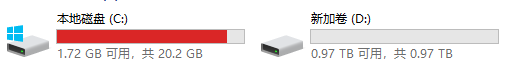

# Windows 电脑 C 盘满了解决方案

> 不是广告 
> 不是广告 
> 不是广告 

> 1.亲测有用（超实用工具） 
>
> 2.完全免费（按照视频操作） 

## 使用 Windows 的你有没有面的情况

## 解决办法

把其他磁盘空闲容量分配给满了的磁盘 - 使用工具 `傲梅分区助手`

## 下载傲梅分区助手

也可以通过`电脑管家` 软件管理搜索 `分区助手`下载，所以它不是病毒软件

1. 搜索引擎搜`傲梅分区助手` - 选择有`官网`标识的链接 - 点击进去

当然你也可以用这个 https://www.disktool.cn/

2. 下载中心 - 分区助手下载 - 找到 分区助手绿色版 - 点击它

## 安装分区助手

按照解压按照向导安装就好了

## 分区助手怎么用？

https://www.disktool.cn/jiaocheng/index.html?paproinst

## 使用分区助手

1. 双击打开刚刚安装好的 分区助手

2. 打开后会看到 你的硬盘分区情况，

3. 只能给相同的硬盘进行分区 - 鼠标右键容量较大的卷 - 分配空闲空间 - 弹窗

4. 选择分配给谁 （那个盘符）大小设置这些 - 点击确认

5. 左上角有 提交按钮 - 具体要执行的步骤也有显示 - 点击提交

6. 然后会让你重启电脑 - 自动进入 PE 状态，点击确认 -

7. 等到自动完成就可以 - 分区完成会显示让你立即重启 点击重启就可以了

分区完成

重新打开电脑发现不变红了

---

## 如果你还不会如何使用

欢迎评论区留言或者私聊加群讨论

---
