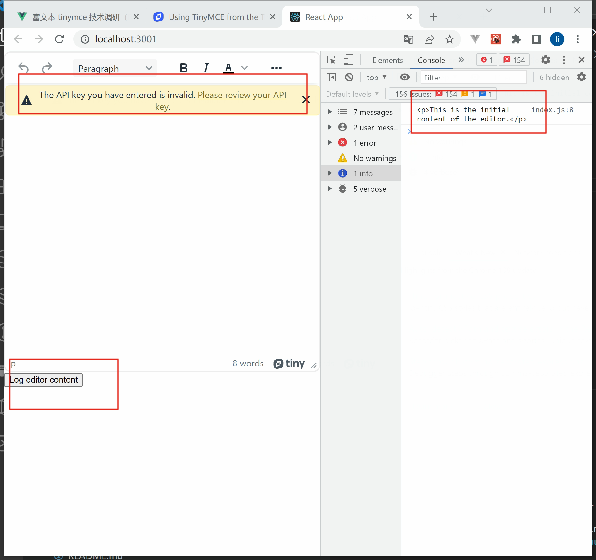

# 富文本 Tinymce 技术调研（React + Node express）

富文本前后端从 0 到 100 拆解实现

最终效果图


## 前端

### Create react app 搭建项目

https://create-react-app.dev/docs/getting-started

#### 初始化项目

```bash
cd frontend
npx create-react-app .
```

#### 删掉没有必要的代码

app.js

```js
import './App.css';

function App() {
  return <div className="App"></div>;
}

export default App;
```

app.css

```css
html,
body {
  margin: 0;
  padding: 0;
  width: 100%;
  height: 100%;
}
#root,
.App {
  width: 100vw;
  height: 100vh;
}
```

### 引入 tinymce 富文本编辑器

https://github.com/tinymce/tinymce-react

https://www.tiny.cloud/docs/tinymce/6/react-cloud/

```bash
npm install --save @tinymce/tinymce-react
```

```bash
#创建文件夹
mkdir -p ./components/TinymceEditor

# 创建文件
# ni touch  ./components/TinymceEditor/index.js
touch  ./components/TinymceEditor/index.js
```

./components/TinymceEditor/index.js

```jsx
import React, {useRef} from 'react';
import {Editor} from '@tinymce/tinymce-react';

export default function TinymceEditor() {
  const editorRef = useRef(null);
  const log = () => {
    if (editorRef.current) {
      console.log(editorRef.current.getContent());
    }
  };
  return (
    <>
      <Editor
        apiKey="your-api-key"
        onInit={(evt, editor) => (editorRef.current = editor)}
        initialValue="<p>This is the initial content of the editor.</p>"
        init={{
          height: 500,
          menubar: false,
          plugins: [
            'advlist',
            'autolink',
            'lists',
            'link',
            'image',
            'charmap',
            'preview',
            'anchor',
            'searchreplace',
            'visualblocks',
            'code',
            'fullscreen',
            'insertdatetime',
            'media',
            'table',
            'code',
            'help',
            'wordcount'
          ],
          toolbar:
            'undo redo | blocks | ' +
            'bold italic forecolor | alignleft aligncenter ' +
            'alignright alignjustify | bullist numlist outdent indent | ' +
            'removeformat | help',
          content_style: 'body { font-family:Helvetica,Arial,sans-serif; font-size:14px }'
        }}
      />
      <button onClick={log}>Log editor content</button>
    </>
  );
}
```

App.js

```js
import './App.css';
import TinymceEditor from './components/TinymceEditor/index';

function App() {
  return (
    <div className="App">
      <TinymceEditor></TinymceEditor>
    </div>
  );
}

export default App;
```

此时你会显示警告提示，原因是 tinymce 在线 api 引入部分插件是需要付费的

`The API key you have entered is invalid. `



### 本地引入 tinymce 消除 `The API key you have entered is invalid`

修改成 本地引入 Tinymce 富文本文件

拷贝 node_modules/tinymce 目录到 public 目录下

消除 `The API key you have entered is invalid.`

| 序号 | 步骤                                                                                 |
| :--: | :----------------------------------------------------------------------------------- |
|  1   | node_modules/tinymce 目录拷贝出来 放到 public 目录                                   |
|  2   | 修改 TinymceEditor/index.js 文件 增加 tinymceScriptSrc="/tinymce/tinymce.min.js"属性 |

### 文件上传包含图片（png，jpg，gif）视频（.mp4）

#### 上传视频参考链接

https://www.tiny.cloud/docs/configure/file-image-upload/#file_picker_callback

tinymce 上传本地视频 https://blog.csdn.net/qq_46380656/article/details/117282921

#### axios 请求拦截响应拦截

```bash
npm install axios --save
```

utils/request.js

```js
/**
 * @file request
 * @author zhongyi.li
 */
import axios from 'axios';

const service = axios.create({
  // baseURL: process.env.NEXT_PUBLIC_BASE_URL,
  // `withCredentials` 表示跨域请求时是否需要使用凭证
  withCredentials: false, // 默认的 send cookies when cross-domain requests
  timeout: 1000 * 60 // request timeout
});

// 请求拦截  设置统一header
service.interceptors.request.use(
  (config) => {
    return config;
  },
  (error) => {
    return Promise.reject(error);
  }
);

// 响应拦截  401 token过期处理
service.interceptors.response.use(
  (response) => {
    return response;
  },
  (error) => {
    return Promise.reject(error);
  }
);

export default service;
```

#### Api 接口请求封装

components/TinymceEditor/index.js

```js
import request from '../utils/request';

// https://stackoverflow.com/questions/47630163/axios-post-request-to-send-form-data
// 上传文件
export function uploadFile(bodyFormData, progress = () => {}) {
  return request({
    url: 'http://localhost:8000/upload',
    headers: {'Content-Type': 'multipart/form-data'},
    method: 'post',
    data: bodyFormData,
    onUploadProgress: (e) => {
      progress((e.loaded / e.total) * 100);
    }
  });
}
```

#### 图片、视频文件上传

```js
import React, {useRef} from 'react';
import {Editor} from '@tinymce/tinymce-react';
import {uploadFile} from '../../api/upload';
export default function TinymceEditor() {
  const editorRef = useRef(null);
  const log = () => {
    if (editorRef.current) {
      console.log(editorRef.current.getContent());
    }
  };

  const example_image_upload_handler = (blobInfo, progress) =>
    new Promise((resolve, reject) => {
      const formData = new FormData();
      formData.append('tinymceFile', blobInfo.blob(), blobInfo.filename());

      uploadFile(formData, progress)
        .then((response) => {
          resolve(response.data.location);
        })
        .catch(reject);

      // const xhr = new XMLHttpRequest();
      // xhr.withCredentials = false;
      // xhr.open('POST', 'http://localhost:8000/upload');

      // xhr.upload.onprogress = (e) => {
      //   progress((e.loaded / e.total) * 100);
      // };

      // xhr.onload = () => {
      //   if (xhr.status === 403) {
      //     reject({message: 'HTTP Error: ' + xhr.status, remove: true});
      //     return;
      //   }

      //   if (xhr.status < 200 || xhr.status >= 300) {
      //     reject('HTTP Error: ' + xhr.status);
      //     return;
      //   }

      //   const json = JSON.parse(xhr.responseText);

      //   if (!json || typeof json.location != 'string') {
      //     reject('Invalid JSON: ' + xhr.responseText);
      //     return;
      //   }

      //   resolve(json.location);
      // };

      // xhr.onerror = (error) => {
      //   console.log('error', error);
      //   reject('Image upload failed due to a XHR Transport error. Code: ' + xhr.status);
      // };

      // const formData = new FormData();
      // formData.append('tinymceFile', blobInfo.blob(), blobInfo.filename());

      // xhr.send(formData);
    });

  const file_picker_callback = (callback, value, meta) => {
    // Provide alternative source and posted for the media dialog
    if (meta.filetype === 'media') {
      // callback('movie.mp4', {source2: 'alt.ogg', poster: 'image.jpg'});
      const input = document.createElement('input');
      input.setAttribute('type', 'file');
      input.setAttribute('accept', 'video/mp4');

      // https://www.tiny.cloud/docs/configure/file-image-upload/#interactiveexample
      input.addEventListener('change', function (event) {
        const file = this.files[0];

        const formData = new FormData();

        formData.append('tinymceFile', file);

        // todo uploading file
        // todo uploading file
        // todo uploading file
        // todo uploading file

        uploadFile(formData)
          .then((response) => {
            // poster 视频封面
            callback(response.data.location, {title: '视频title'});
          })
          .catch((error) => {
            console.error('[uploadFile media error]', error);
            callback('', {title: '视频title'});
          });
      });

      input.click();
    }
  };

  return (
    <>
      <Editor
        onInit={(evt, editor) => (editorRef.current = editor)}
        initialValue="<p>This is the initial content of the editor.</p>"
        tinymceScriptSrc="/tinymce/tinymce.min.js"
        init={{
          height: 500,
          menubar: false,
          image_title: true,
          automatic_uploads: true,
          images_upload_handler: example_image_upload_handler,
          /*
            URL of our upload handler (for more details check: https://www.tiny.cloud/docs/configure/file-image-upload/#images_upload_url)
            images_upload_url: 'postAcceptor.php',
            here we add custom filepicker only to Image dialog
          */
          file_picker_types: 'media',
          /* and here's our custom image picker*/
          file_picker_callback,
          plugins: [
            'advlist',
            'autolink',
            'lists',
            'link',
            'image',
            'charmap',
            'preview',
            'anchor',
            'searchreplace',
            'visualblocks',
            'code',
            'fullscreen',
            'insertdatetime',
            'media',
            'table',
            'help',
            'wordcount'
          ],
          toolbar:
            'undo redo | blocks | ' +
            'bold italic forecolor | alignleft aligncenter ' +
            'alignright alignjustify | bullist numlist outdent indent | ' +
            'removeformat | help |' +
            'link image media | code',
          content_style: 'body { font-family:Helvetica,Arial,sans-serif; font-size:14px }'
        }}
      />
      <button onClick={log}>Log editor content</button>
    </>
  );
}
```

### 样式调整

#### 增加标题

App.js

```js
import './App.css';
import TinymceEditor from './components/TinymceEditor/index';

function App() {
  return (
    <div className="App">
      <div className="example">
        <h1 className="title">富文本 tinymce 技术调研（React + Node express）</h1>
        <TinymceEditor></TinymceEditor>
      </div>
    </div>
  );
}

export default App;
```

#### 增加 CSS3 媒体查询

媒体查询 https://c.runoob.com/codedemo/5371/

```css
html,
body {
  margin: 0;
  padding: 0;
  width: 100%;
  height: 100%;
}
#root,
.App {
  width: 100vw;
  height: 100vh;
  overflow: auto;
}

/* https://c.runoob.com/codedemo/5371/ */
.example {
  margin: 0 auto;
  padding: 20px;
  box-sizing: border-box;
}
.example .title {
  color: #fff;
}
/* 超小设备 (手机, 600px 以下屏幕设备) */
@media only screen and (max-width: 600px) {
  body {
    background: red;
  }
  .example {
    padding: 10px;
    width: 100vw;
  }
}

/* 小设备 (平板电脑和大型手机，600 像素及以上) */
@media only screen and (min-width: 600px) {
  body {
    background: green;
  }
  .example {
    width: 90vw;
  }
}

/* 中型设备（平板电脑，768 像素及以上） */
@media only screen and (min-width: 768px) {
  body {
    background: blue;
  }
  .example {
    width: 80vw;
  }
}

/* 大型设备（笔记本电脑/台式机，992 像素及以上） */
@media only screen and (min-width: 992px) {
  body {
    background: orange;
  }
  .example {
    width: 75vw;
  }
}

/* 超大型设备（大型笔记本电脑和台式机，1200 像素及以上） */
@media only screen and (min-width: 1200px) {
  body {
    background: pink;
  }
  .example {
    width: 70vw;
  }
}
```

### 删掉右下角 logo

全文检索下面关键字

```
tox-statusbar__branding
```

## 后端

### node express

```bash
ni server.js
```

```bash
npm init -y
```

```bash
npm i --save express nodemon
```

npm express-fileupload https://www.npmjs.com/package/express-fileupload

https://github.com/richardgirges/express-fileupload/tree/master/example

```bash
npm i --save express-fileupload
```

```bash
npm i cors --save
```

package.json

```json
  "scripts": {
    "dev": "nodemon server.js",
    "start": "node server.js"
  },
```

server.js

```js
const express = require('express');
const fileUpload = require('express-fileupload');
const cors = require('cors');
const app = express();
const path = require('path');
const md5 = require('md5');

const PORT = 8000;

// 允许跨域
app.use(cors());

// 静态资源目录设置
app.use('/', express.static(path.join(__dirname, 'public')));

app.use(
  fileUpload({
    limits: {fileSize: 50 * 1024 * 1024}, // 限制最大文件大小为50m
    createParentPath: true, //  是否自动创建文件路径
    useTempFiles: true, // 使用临时文件
    tempFileDir: '/tmp/', // 使用临时文件
    uriDecodeFileNames: true, // 解码文件名
    safeFileNames: true, // 安全文件名
    abortOnLimit: true // 大小超出直接返回413
  })
);

// 测试
app.get('/ping', function (req, res) {
  res.send('pong');
});

// https://github.com/richardgirges/express-fileupload/blob/master/example/server.js
// 文件上传
app.post('/upload', function (req, res) {
  try {
    let tinymceFile;
    let uploadPath;
    let fileMd5;

    if (!req.files || Object.keys(req.files).length === 0) {
      res.status(400).send('No files were uploaded.');
      return;
    }

    tinymceFile = req.files.tinymceFile;

    fileMd5 = tinymceFile && tinymceFile.md5;

    if (!fileMd5) {
      fileMd5 = md5(tinymceFile.data);
    }
    // console.log('fileMd5', fileMd5);

    const fileName = `${fileMd5}${path.extname(tinymceFile.name)}`;

    uploadPath = path.join(__dirname, '/public/uploads/', fileName);

    tinymceFile.mv(uploadPath, function (err) {
      if (err) {
        return res.status(500).send(err);
      }
      res.json({location: 'http://localhost:8000/uploads/' + fileName});
    });
  } catch (error) {
    console.error('[error]', error);
    res.status(500).json({message: 'Server error'});
  }
});

app.listen(PORT, function () {
  console.log('Express server listening on port ', PORT); // eslint-disable-line
});
```
