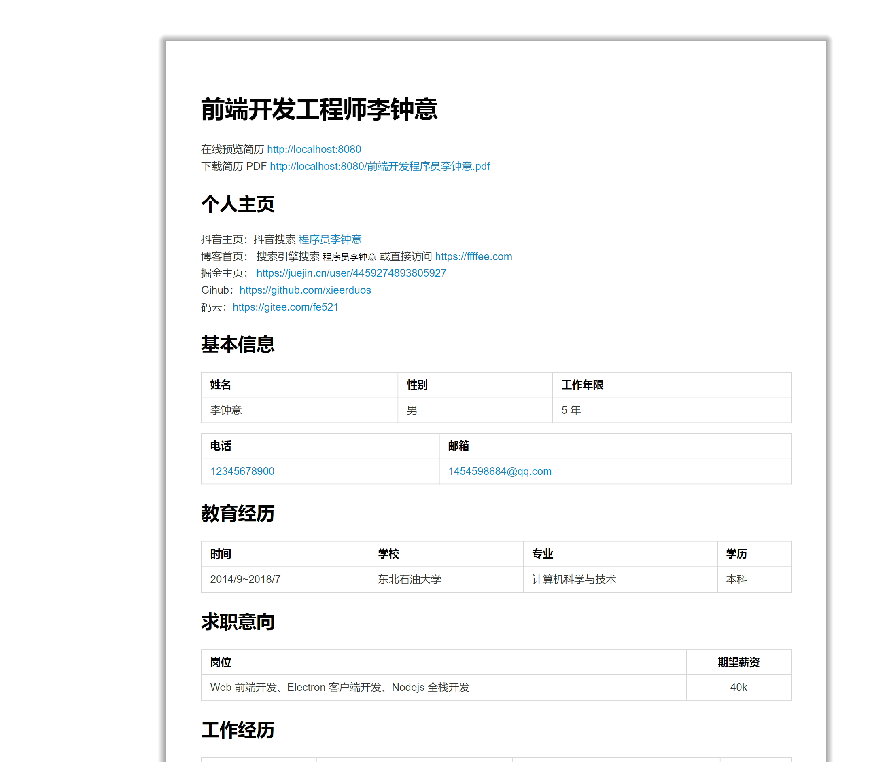

# 如何使用 Markdown 写简历

使用 Markdown 写简历转换成 PDF，然后在线预览 pdf。

## 生成 PDF 并且在线预览步骤

| 序号 | 摘要                                 | 备注          |
| :--: | :----------------------------------- | :------------ |
|  1   | 安装 Vscode 插件 Markdown Preview    |               |
|  2   | Vscode 编写 Markdown 简历            |               |
|  3   | 使用 Markdown Preview 预览           |               |
|  4   | 鼠标右键 - Chrome（Puppeteer） - PDF | 导出 pdf 文件 |
|  5   | pdfjs-dist 在线预览 PDF 文件         | Vue 项目例子  |

## 最终效果展示

