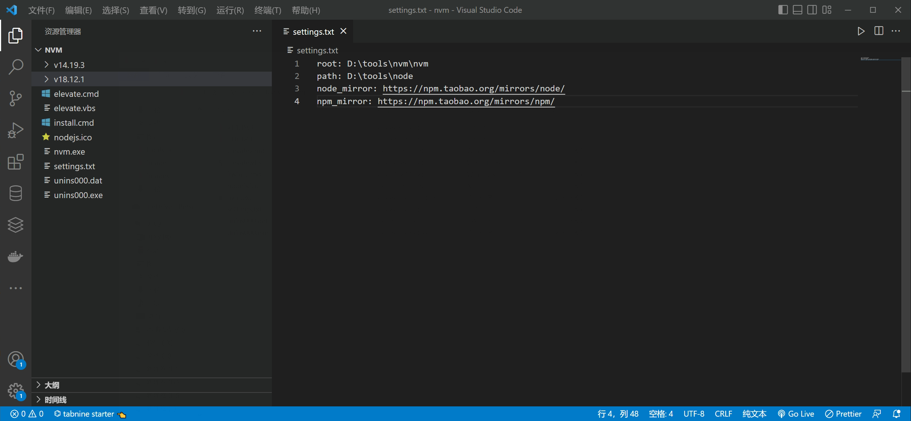

# Windows 如何安装 nvm 管理 nodejs

## 安装包下载地址

官方地址：https://github.com/coreybutler/nvm-windows/releases

如下图下载下来，解压出来双击就可以了安装了

<br>

---

## 更换为淘宝镜像

[nvm 下载 Nodejs 太慢了 更换成淘宝镜像](https://blog.csdn.net/qq_32754575/article/details/102412473)

把下面两行代码 复制到 nvm 的安装目录下

<br>

```txt
node_mirror: https://npm.taobao.org/mirrors/node/
npm_mirror: https://npm.taobao.org/mirrors/npm/
```

<br>

在执行下面命令就很快了

```bash
# 安装node 18.12.1 版本
nvm install 18.12.1
```
