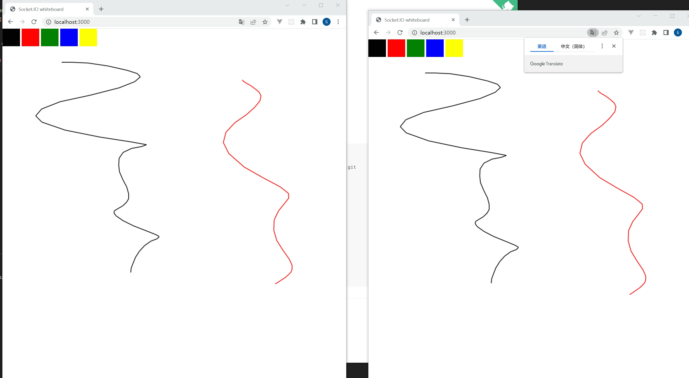

# socket.io

官网文档地址 https://socket.io/zh-CN/

开源仓库地址 https://github.com/socketio/socket.io

## 白板功能

```bash
# 克隆项目
git clone git@github.com:socketio/socket.io.git

# 进入到项目根目录
cd socket.io

# 切换到白板的例子
cd /examples/whiteboard

# 安装
npm install

# 启动白板功能 3000 端口
npm start
```

本地访问地址：http://localhost:3000

<br/>
